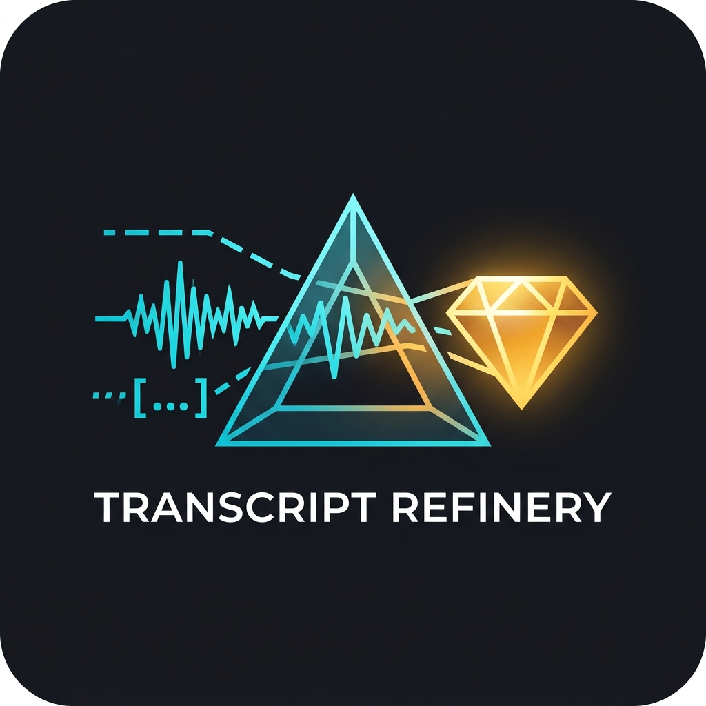
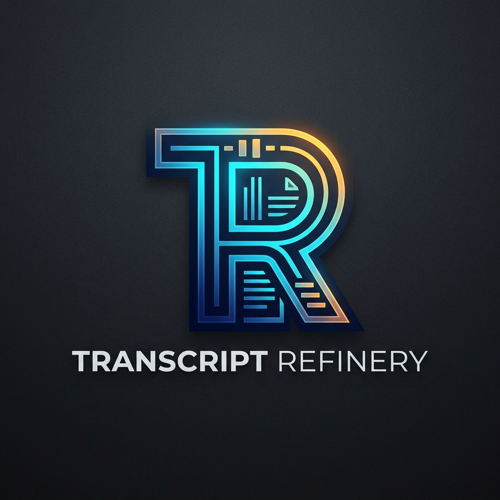
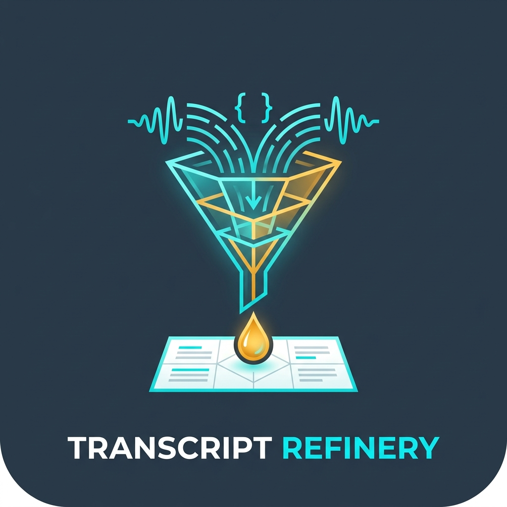
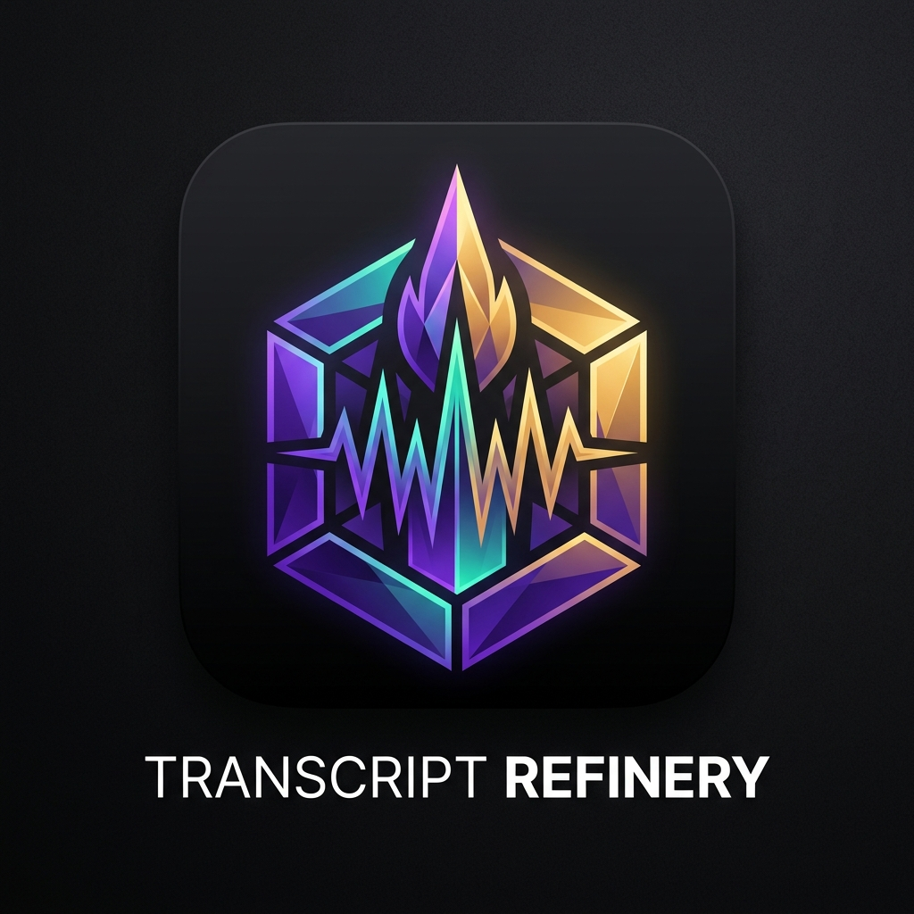

# Transcript Refinery Logó Koncepciók

A projekt céljához (nyers feliratok és audio deduplikálása és strukturált Obsidian tudásanyaggá finomítása) generált logótervek.

| Koncepció | Kép | Leírás |
|---|---|---|
| **1. Prizma & Kristály** |  | Nyers hanghullám és felirat-zaj szűrése prizmán át arany tudás-gyémánttá |
| **2. TR Monogram** |  | Letisztult fejlesztői T+R ligatúra belső hullám- és dokumentum-vonalakkal |
| **3. Finomító Tölcsér** |  | Klasszikus szűrő/desztilláló tölcsérből Markdown lapra hulló koncentrált tudáscsepp |
| **4. Obszidián Hexagon** |  | Dark-mode hexagon kristály keret hanghullámmal és a finomítás belső lángjával |
