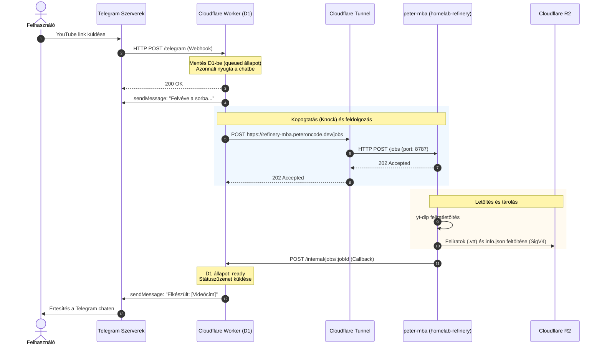

# Telegram Bot és Cloudflare Worker Topológia

Ez a dokumentum a Telegram bot, a Cloudflare Worker és a `refinery serve` démon közötti kommunikációs architektúrát, a konfigurációk helyét, valamint a helyi fejlesztés és az éles környezet elválasztását foglalja össze.

---

## 1. Architektúra és adatfolyam

A rendszer három fő komponensből áll:
1. **Telegram Bot API**: a felhasználói felület, amely webhookon keresztül továbbítja az üzeneteket.
2. **Cloudflare Worker (`transcript-refinery`)**: a belépési kapu, amely fogadja a webhookot, kezeli a feladatok állapotát (D1 adatbázis), cron alapján ellenőriz, és kopogtat a háttérdémonnál.
3. **`refinery serve` démon (`peter-mba` Docker konténer)**: a tényleges feldolgozó (yt-dlp letöltés és Cloudflare R2 szinkronizáció), amely Cloudflare Tunnelen keresztül érhető el.

### Adatfolyam ábra



---

## 2. Hol vannak a beállítások?

Gyakori kérdés, hogy melyik beállítás hol él a rendszerben:

| Beállítás | Hol van rögzítve? | Megjegyzés / Érték |
|---|---|---|
| **Telegram Webhook URL** | **A Telegram szerverein** (Telegram Bot API) | Nem lokális fájl! A Telegram API `setWebhook` metódusával lett beállítva: `https://transcript-refinery.peteroncode.workers.dev/telegram`. |
| **Worker célpont (`SERVE_URL`)** | **Cloudflare Secret** | A Worker ebből tudja, hova kell küldenie a munkát: `https://refinery-mba.peteroncode.dev`. |
| **Közös titok (`REFINERY_SERVE_SECRET`)** | **Cloudflare Secret & Infisical** | Hitelesíti a Worker kéréseit a démon felé (`Authorization: Bearer ...`). |
| **D1 Adatbázis azonosító** | `worker/wrangler.toml` | A Worker adatbázis kötése (`binding = "DB"`, id: `4fd2c124-7dcf-42a9-9e65-2ee224113967`). |
| **peter-mba Docker környezet** | `homelab/services/refinery/` | `docker-compose.yml` és `config.peter-mba.yaml` kezeli a könyvtárak és hálózatok csatolását. |

---

## 3. Helyi fejlesztés vs. Éles működés

### Miért nem kapja meg a helyi géped a Telegram üzeneteket?
Amikor lokálisan futtatod a `pnpm serve`-t vagy a `pnpm worker:dev`-et a fejlesztői gépeden:
- A Telegram szerverei kizárólag a regisztrált publikus webhook URL-re (`transcript-refinery.peteroncode.workers.dev`) küldenek kéréseket.
- A felhős Worker `SERVE_URL` változója a `peter-mba` Cloudflare Tunnel címére mutat, nem a helyi gépedre.
- **Emiatt az éles Telegram forgalom kizárólag a `peter-mba` célgépen futó konténerhez jut el.**

### Hogyan tesztelj lokálisan?

#### A) A démon önálló fejlesztése (`pnpm serve`)
Ha a letöltési, átalakítási vagy R2-feltöltési logikát teszteled:
1. Indítsd el a démont lokálisan:
   ```bash
   pnpm serve
   ```
2. Küldj be közvetlen tesztfeladatot `curl`-lel a helyi portra (`8787`):
   ```bash
   curl -i -X POST http://localhost:8787/jobs \
     -H "Authorization: Bearer $REFINERY_SERVE_SECRET" \
     -H "Content-Type: application/json" \
     -d '{"jobId":"local-test-1","url":"https://www.youtube.com/watch?v=dQw4w9WgXcQ","videoId":"dQw4w9WgXcQ"}'
   ```
   *Előny*: nem kell a Telegrammal vagy a felhős Workerrrel bajlódni, a konzolon azonnal látható az összes napló (`[serve]`, `[fetch]`, `[r2]`).

#### B) A Cloudflare Worker önálló fejlesztése (`pnpm worker:dev`)
Ha a Worker logikát (webhook feldolgozás, D1 állapotgép, percenkénti cron) módosítod:
1. Indítsd el a lokális workerd példányt:
   ```bash
   pnpm worker:dev
   ```
   *(Ez a `8788`-as porton indul el, hogy ne ütközzön a 8787-es serve porttal).*
2. Szimulálj beérkező Telegram webhookot:
   ```bash
   curl -X POST http://localhost:8788/telegram \
     -H "Content-Type: application/json" \
     -H "X-Telegram-Bot-Api-Secret-Token: <TELEGRAM_WEBHOOK_SECRET>" \
     -d '{"update_id": 1, "message": {"message_id": 1, "chat": {"id": 123456}, "text": "https://www.youtube.com/watch?v=dQw4w9WgXcQ"}}'
   ```
3. Teszteld a háttérben futó percenkénti cront:
   ```bash
   curl http://localhost:8788/__scheduled
   ```

#### C) Helyi debug külön Telegram-bottal

Egy botnak egyszerre egy webhookja lehet. Az éles bot a `https://transcript-refinery.peteroncode.workers.dev/telegram` címen marad. A helyi, konténeren kívüli `refinery serve` és a helyi Wrangler D1 a `scripts/telegram-debug.sh` scripten keresztül egy második botot kap. A Cloudflare-ön tárolt `SERVE_URL` titok nem változik. A Dockerben futó `homelab-cloudflared` a gép `8788`-as portját nem éri el, ezért az alagút `ngrok`.

A script az Infisical `dev` környezetének `/peter-mbp` útjáról olvas. A debug-bot tokenje és webhook-titka külön név, nem írja felül az éles kulcsokat:

| Infisical kulcs | A helyi `worker/.dev.vars` sora |
|---|---|
| `TELEGRAM_DEBUG_BOT_TOKEN` | `TELEGRAM_BOT_TOKEN` |
| `TELEGRAM_OWNER_CHAT_ID` | `TELEGRAM_OWNER_CHAT_ID` |
| `TELEGRAM_DEBUG_WEBHOOK_SECRET` | `TELEGRAM_WEBHOOK_SECRET` |
| `REFINERY_SERVE_SECRET` | `REFINERY_SERVE_SECRET` |
| — | `SERVE_URL=http://127.0.0.1:8787` |

A `TELEGRAM_DEBUG_BOT_TOKEN` a BotFather tokenje. Ha nincs benne kettőspont, a script nem indít folyamatot. A `TELEGRAM_OWNER_CHAT_ID` a saját privát chat azonosítója, ugyanaz, mint az éles botnál. A `8787`, `8788`, `9229`, `9230` és `4040` port legyen szabad. A `9229`-en maradt `workerd` miatt a Wrangler `Address already in use` hibával kilép, és a script csak annyit lát, hogy a `8788` nem nyílt meg. Kell hozzá `ngrok`, `jq`, `infisical` és `lsof`. A futása alatt ne indítsd a `pnpm worker:dev` és a `./scripts/worker-dev-vars.sh` parancsot: mindkettő felülírja a `worker/.dev.vars` fájlt az éles titkokkal, és a `SERVE_URL` akkor a `peter-mba` alagútja lenne. A `pnpm serve:inspect` és a **Serve: Inspect (port 9230)** profil se fusson: mindkettő másik serve-t indítana a `8787`-es porton.

Két dolog nélkül a script elindul, majd elhal. Mindkettő a script előtt kell.

Az ngroknak bejelentkezett fiók kell. Konfiguráció nélkül elindul a `127.0.0.1:4040` cím, aztán `ERR_NGROK_4018` hibával kilép, és a script `curl: (7) Failed to connect to 127.0.0.1 port 4040` sorokat ír. A tokent a https://dashboard.ngrok.com/get-started/your-authtoken címről lehet kimásolni, egyszer:

```bash
ngrok config add-authtoken <a dashboard tokenje>
```

A Wrangler a `transcript-refinery/classify` importot a `dist/fetch/classify.js` fájlból oldja fel. Build nélkül a `tmp/telegram-debug/wrangler.log` ezt írja: `Could not resolve "transcript-refinery/classify"`. A worktree gyökerében:

```bash
pnpm build
```

A worktree gyökeréből:

```bash
./scripts/telegram-debug.sh
```

A script ezt teszi:

1. Lefuttatja a `pnpm worker:migrate:local` parancsot. A Wrangler nem kap `--remote` kapcsolót, ezért a `8788`-as porton a helyi D1-et használja.
2. Összeállítja a `worker/.dev.vars` fájlt a fenti táblázat szerint. A korábbi fájlt elteszi, és leállításkor visszaírja.
3. Elindítja a `refinery serve` folyamatot a `127.0.0.1:8787` címen, `tsx --inspect=127.0.0.1:9230` kapcsolóval. A `WORKER_CALLBACK_URL` értéke `http://127.0.0.1:8788`, ezért a visszahívás a helyi D1-be megy. A `pnpm serve` és a VS Code **CLI: Serve (pnpm serve)** profilja ezt nem így csinálja: azok az éles Worker címét töltik be, és inspector nélkül indulnak.
4. Elindítja a Wranglert export nélkül, a `8788`-as porton. A töréspont a `127.0.0.1:9229` címen van. A helyi cron nem indul magától. Egy kör, amíg a script fut: `curl http://127.0.0.1:8788/__scheduled`.
5. Elindítja az `ngrok http 8788` parancsot, és a `http://127.0.0.1:4040/api/tunnels` címről kiolvassa a nyilvános `https` címet. Csak a debug-tokennel hívja a `setWebhook` metódust. Az `url` a cím `/telegram` útja. Az `allowed_updates` a `message` és a `callback_query` típust is tartalmazza, ezért a `summary` gomb koppintása megérkezik.

A script kiírja a webhook címet és a két töréspontot. Az új botnak küldött YouTube-cím ettől fogva a helyi láncon megy. A logok a `tmp/telegram-debug/` mappában vannak: `serve.log`, `wrangler.log`, `ngrok.log`.

A script mindkét folyamatot inspectorral indítja. A csatoláshoz a worktree legyen a megnyitott mappa.

1. Várd meg ezt a két sort: `A Wrangler töréspontja: 127.0.0.1:9229` és `A serve töréspontja: 127.0.0.1:9230`.
2. A Run and Debug panelen a **Worker: Attach (port 9229)** profilt indítsd. A **Worker: Dev (wrangler dev)** profilt ne indítsd: az a `pnpm worker:dev` parancsot futtatja, és felülírja a `worker/.dev.vars` fájlt.
3. A **Serve: Attach (port 9230)** profilt is indítsd. A **Serve: Inspect (port 9230)** profilt ne indítsd: az a `pnpm serve:inspect` parancs, és egy második serve-t akar a `8787`-es porton.
4. A Worker töréspontját a `worker/src` alá tedd, a serve töréspontját a `src/serve/` alá, mielőtt üzenetet küldesz a debug-botnak. A Worker belépése a `worker/src/index.ts` fájlban van, a gomb a `handleTap` függvényben.

A `pnpm serve:inspect` a debug script nélkül indítja a serve-t, `NODE_OPTIONS='--inspect=127.0.0.1:9230'` környezettel. Az Infisical-titkok és a `SERVE_OUT` ugyanazok, mint a `pnpm serve` parancsnál. A `tsx` forrástérképet ad, ezért a töréspont a `src/` alatti TypeScript-fájlban áll meg. Ez a parancs az éles `WORKER_CALLBACK_URL` címet tölti be, ugyanúgy, mint a `pnpm serve` és a **CLI: Serve (pnpm serve)** profil. A visszahívás az éles D1-be megy. A `8787`-es porton egyszerre egy serve futhat, ezért a `scripts/telegram-debug.sh` mellett ne indítsd.

A `Ctrl+C` törli a debug-bot webhookját, leállítja a serve folyamatot, a Wranglert és az ngrokot, majd visszaállítja a korábbi `worker/.dev.vars` fájlt. Az éles bot webhookját nem kell visszaállítani, mert a script nem módosítja.

---

---

## 4. A Bot bemenetei és viselkedése

A botnak nincsenek hagyományos `/parancsai`; a beérkező üzenetet szóközök mentén szavakra bontja, és minden elemet önállóan értékel (`worker/src/plan.ts`):

| Bemenet formátuma | Feldolgozás módja | Bot válasza |
|---|---|---|
| **YouTube videó URL** (`watch?v=...`, `youtu.be/...`) | Felveszi a feldolgozási sorba, elindítja a kopogtatást | `Sorba került: <id>` |
| **11 karakteres videó ID** (pl. `dQw4w9WgXcQ`) | Felismeri videóként, feldolgozza | `Sorba került: <id>` |
| **Több videó egy üzenetben** | Mindegyik videót külön elemként sorba rendezi | Többsoros válasz mindegyik státuszával |
| **Már sorban lévő videó** | Megelőzi a duplikációt | `Már sorban van: <id>.` |
| **Lejátszási lista URL** | Jelenleg kihagyja | `Lejátszási lista későbbre marad.` |
| **Nem YouTube webcím** | Érvénytelen forrásként jelzi | `Nem YouTube-cím.` |
| **Bármilyen egyéb szöveg** | Nem indít feladatot | `Nincs YouTube-videó az üzenetben.` |

### Életciklus üzenetek a chaten:
- **Ha a peter-mba nem érhető el**: `A gép ébredésére vár: <id>.` (a háttérben futó percenkénti Cloudflare Cron újra próbálkozik).
- **Sikeres letöltés és R2 feltöltés**: `<cím>. A felirat megvan.`
- **Hiba**: a démon által visszaküldött hibaüzenet (pl. `Nincs felirat` vagy `A konténer elutasította a hívást.`).

> [!NOTE]
> **Biztonsági szűrés**: A bot kizárólag a `TELEGRAM_OWNER_CHAT_ID` azonosítójú privát chatből fogad el parancsokat. Bármely más felhasználótól vagy csoportból érkező üzenetet a Worker válasz nélkül, csendben eldob (`HTTP 200`).

---

## 5. Telegram Bot API kezelése curl-lel

A bot webhookját és állapotát közvetlenül a hivatalos Telegram Bot API-n keresztül tudod felügyelni. A titkokat érdemes a `worker/.dev.vars`-ból betölteni a munkamenetbe:

```bash
set -a; source worker/.dev.vars; set +a
API="https://api.telegram.org/bot${TELEGRAM_BOT_TOKEN}"
```

### Gyakran használt Bot API hívások

| Művelet | Parancs | Megjegyzés |
|---|---|---|
| **Webhook állapot lekérdezése** | `curl -s "$API/getWebhookInfo" \| jq` | Mutatja a regisztrált URL-t, a függő üzenetek számát és az utolsó hibát. |
| **Webhook beállítása az éles Workerre** | `curl -s "$API/setWebhook" -F "url=https://transcript-refinery.peteroncode.workers.dev/telegram" -F "secret_token=$TELEGRAM_WEBHOOK_SECRET" -F 'allowed_updates=["message","callback_query"]' -F "drop_pending_updates=true"` | Beállítja a webhook URL-t és a hitelesítő tokent. A `callback_query` a `summary` gomb. Üres `allowed_updates` minden típust enged. |
| **Webhook törlése** | `curl -s "$API/deleteWebhook?drop_pending_updates=true"` | Eltávolítja a webhookot. Szükséges, ha kézzel szeretnéd lekérdezni a `getUpdates`-et. |
| **Bot token ellenőrzése** | `curl -s "$API/getMe" \| jq` | Ellenőrzi, hogy a token él-e és visszaadja a bot nevét/adatait. |
| **Frissítések lekérése kézzel (Chat ID kereséshez)** | `curl -s "$API/getUpdates" \| jq` | **Csak törölt webhook mellett működik!** Segít kideríteni a saját `chat_id`-dat, ha ráírsz a botra. |
| **Közvetlen üzenetküldés tesztelése** | `curl -s "$API/sendMessage" -H "Content-Type: application/json" -d "{\"chat_id\": $TELEGRAM_OWNER_CHAT_ID, \"text\": \"Teszt üzenet\"}"` | Megkerüli a Workert, közvetlenül a chatedbe küld üzenetet a bot nevében. |

---

## 6. Worker webhook tesztelése curl-lel

Ha a Telegram alkalmazás nélkül szeretnéd tesztelni a Cloudflare Worker webhook fogadását, közvetlenül beküldhetsz egy emulált Telegram update-et:

```bash
set -a; source worker/.dev.vars; set +a

curl -i -X POST https://transcript-refinery.peteroncode.workers.dev/telegram \
  -H "Content-Type: application/json" \
  -H "X-Telegram-Bot-Api-Secret-Token: $TELEGRAM_WEBHOOK_SECRET" \
  -d "{\"update_id\": $(date +%s), \"message\": {\"message_id\": 1, \"chat\": {\"id\": $TELEGRAM_OWNER_CHAT_ID}, \"text\": \"https://www.youtube.com/watch?v=dQw4w9WgXcQ\"}}"
```

- **`update_id`**: Mindig egyedi számnak kell lennie (a fenti parancsban az aktuális epoch időbélyeg), mivel a Worker a már látott `update_id`-kat idempotensen eldobja.
- **Lokális Worker tesztelése**: Ugyanez a kérés futtatható a `http://localhost:8788/telegram` címre is, ha a gépeden fut a `pnpm worker:dev`.

---

## 7. Üzemeltetési és ellenőrző parancsok

### Éles Cloudflare Worker élő naplózása
```bash
npx wrangler tail --config worker/wrangler.toml
```

### Éles démon konténer naplózása (peter-mba)
```bash
ssh peter-mba 'docker logs -f homelab-refinery'
```

### Cloudflare Tunnel végpont gyors ellenőrzése kívülről
```bash
curl -i -X POST https://refinery-mba.peteroncode.dev/jobs
# Elvárt válasz: HTTP 401 Unauthorized (mivel nincs Bearer token)
```
